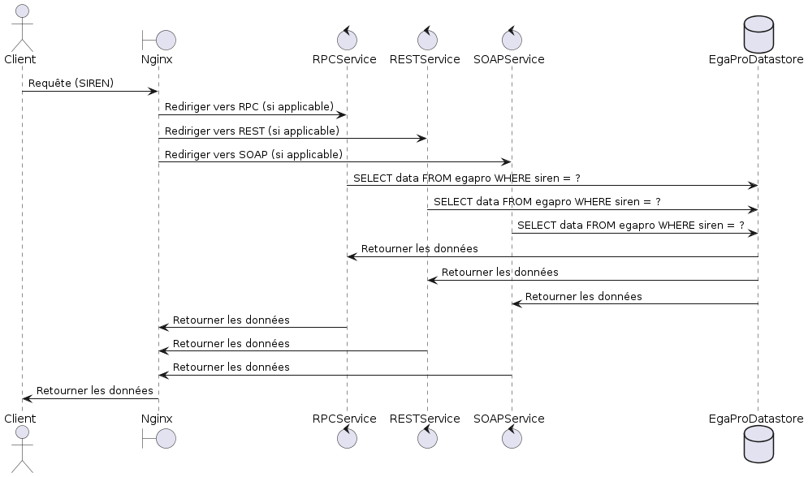

# Projet EgaPro

## Introduction
Ce projet vise à distribuer les données de l'Index EgaPro via trois types de services : RPC, REST et SOAP. 

## Architecture des Services
Tous les services utilisent une seule base de données PostgreSQL commune pour stocker et récupérer les données. Nginx est configuré comme un reverse proxy pour diriger les requêtes vers les services appropriés.

## Diagramme de Séquence
Voici un diagramme de séquence illustrant les interactions entre les composants :

### Image du diagramme de séquence



### Code PlantUML du diagramme de séquence
Si vous souhaitez voir le diagramme en dynamique, voici le code PlantUML utilisé :

```plantuml
@startuml
actor Client
boundary Nginx
control RPCService
control RESTService
control SOAPService
database EgaProDatastore

Client -> Nginx: Requête (SIREN)
Nginx -> RPCService: Rediriger vers RPC (si applicable)
Nginx -> RESTService: Rediriger vers REST (si applicable)
Nginx -> SOAPService: Rediriger vers SOAP (si applicable)

RPCService -> EgaProDatastore: SELECT data FROM egapro WHERE siren = ?
RESTService -> EgaProDatastore: SELECT data FROM egapro WHERE siren = ?
SOAPService -> EgaProDatastore: SELECT data FROM egapro WHERE siren = ?

EgaProDatastore -> RPCService: Retourner les données
EgaProDatastore -> RESTService: Retourner les données
EgaProDatastore -> SOAPService: Retourner les données

RPCService -> Nginx: Retourner les données
RESTService -> Nginx: Retourner les données
SOAPService -> Nginx: Retourner les données

Nginx -> Client: Retourner les données
@enduml
